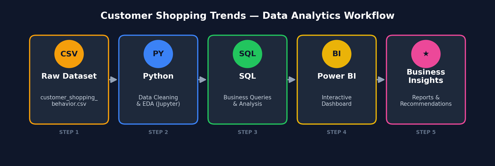

# 🛍️ Customer Shopping Trends — Data Analytics Project

Turning 3,900 rows of raw retail data into revenue, segmentation and marketing insights using Python, SQL and Power BI.



---

## 📌 Overview

This is an end-to-end, industry-standard data analytics project built on a **customer shopping behavior dataset** from the retail sector. The goal is to simulate the complete workflow of a professional Data Analyst — from raw data to a decision-ready dashboard:

1. **Python** — clean, validate and enrich the raw dataset (handle missing values, feature engineering, data type fixes).
2. **SQL** — load the cleaned data into a relational database and answer real business questions with queries.
3. **Power BI** — build an interactive dashboard to visualize customer segments, sales trends and product performance.

The project is designed as a portfolio piece to demonstrate practical skills across the full analytics stack, not just one tool in isolation.

---

## 🎯 Business Problem

A retail business wants to understand its customers better in order to improve marketing spend, product stocking and customer retention. Specifically, the analysis answers:

- Which customer segments (age, gender, subscription status) generate the most revenue?
- Do discounts and promo codes actually drive higher spending, or just erode margin?
- Which products and categories perform best, by both sales volume and review rating?
- Are loyal / repeat customers more likely to subscribe, and how should they be targeted differently from new customers?
- How does shipping type and purchase frequency relate to customer value?

Full business problem definition and findings are documented in [`aboutProject/`](aboutProject/).

---

## 🧰 Tech Stack

| Layer | Tool | Purpose |
|---|---|---|
| Data Cleaning & EDA | Python (Pandas) in Jupyter Notebook | Handle nulls, fix data types, feature engineering |
| Data Storage & Querying | SQL (PostgreSQL / MySQL) | Load cleaned data, run business-question queries |
| Visualization | Power BI | Interactive dashboard for stakeholders |
| Documentation | PDF | Business problem statement + analysis write-up |

---

## 📂 Project Structure

```text
Data-Analysis-Python-SQL-PowerBI/
│
├── aboutProject/
│   ├── business-problem-document.pdf        # Business context & objectives
│   └── customer-shopping-behavior-analysis.pdf   # Written analysis & findings
│
├── dataset/
│   └── customer_shopping_behavior.csv        # Raw dataset (3,900 records, 18 columns)
│
├── python/
│   └── Customer_Shopping_Behavior_Analysis.ipynb   # Data cleaning, EDA, feature engineering
│
├── sql/
│   └── customer_shopping_behavior.sql        # 10 business-question SQL queries
│
├── power_bi/
│   └── customer_behavior_dashboard.pbix      # Interactive Power BI dashboard
│
├── assets/
│   └── workflow_diagram.png                  # Project workflow diagram (this README)
│
├── .gitignore
├── LICENSE
└── README.md
```

## 🔄 Workflow

The diagram above shows the pipeline end-to-end. In short:

**Raw CSV → Python (clean & engineer features) → SQL (query & analyze) → Power BI (visualize) → Business insights & recommendations**

Key steps performed in the Python notebook:
- Loaded the raw CSV with Pandas and inspected structure with `.info()` / `.describe()`.
- Imputed missing `Review Rating` values using the median rating per product category.
- Standardized column names to snake_case for consistency across tools.
- Engineered new features: `age_group` (quartile-based segmentation) and `purchase_frequency_days` (mapped from purchase frequency labels).
- Removed a redundant column (`promo_code_used` duplicated `discount_applied`).
- Exported the cleaned dataset into a SQL database for querying.

Key business questions answered in SQL (`sql/customer_shopping_behavior.sql`):
1. Total revenue by gender
2. High-spending customers who still used discounts
3. Top 5 products by average review rating
4. Standard vs. Express shipping — average purchase comparison
5. Subscribed vs. non-subscribed customer spend
6. Top 5 products by discount usage percentage
7. Customer segmentation: New / Returning / Loyal
8. Top 3 products per category
9. Repeat buyers vs. subscription likelihood
10. Revenue contribution by age group

---

## 📊 Key Insights / Dashboard Preview

> Replace this section with 3–5 bullet points of your actual top findings once you finalize the analysis, for example:
> - Loyal customers (5+ previous purchases) contribute **X%** of total revenue despite being only **Y%** of the customer base.
> - Subscribed customers spend **$Z more on average** than non-subscribed customers.
> - The **Clothing** category leads in both purchase volume and average rating.

Add a screenshot of your Power BI dashboard here:

```markdown

```

(Export a `.png` of your `.pbix` dashboard's main page and add it to `assets/` to complete this section.)

---

## ⚙️ How to Run Locally

```bash
# 1. Clone the repository
git clone https://github.com/Azeem8541/Data-Analysis-Python-SQL-PowerBI.git
cd Data-Analysis-Python-SQL-PowerBI

# 2. Set up a Python environment
python -m venv venv
source venv/bin/activate      # Windows: venv\Scripts\activate
pip install pandas jupyter sqlalchemy psycopg2-binary

# 3. Run the notebook
jupyter notebook python/Customer_Shopping_Behavior_Analysis.ipynb
```

**SQL:**
- Create a database (`customer_behavior`) in PostgreSQL/MySQL/SQL Server.
- Load the cleaned dataset (via the notebook's `to_sql()` step, or import the CSV directly).
- Run the queries in `sql/customer_shopping_behavior.sql`.

**Power BI:**
- Open `power_bi/customer_behavior_dashboard.pbix` in Power BI Desktop.
- Refresh the data source if prompted.

> ⚠️ **Security note:** the notebook currently contains hardcoded database credentials in one of the connection cells. Before pushing further updates, replace these with environment variables (e.g. a `.env` file loaded via `python-dotenv`) and make sure `.env` is listed in `.gitignore` — never commit real credentials, even placeholder-looking ones, to a public repo.

---

## 📁 Dataset Info

- **File:** `dataset/customer_shopping_behavior.csv`
- **Records:** 3,900 customers
- **Columns (18):** Customer ID, Age, Gender, Item Purchased, Category, Purchase Amount (USD), Location, Size, Color, Season, Review Rating, Subscription Status, Shipping Type, Discount Applied, Promo Code Used, Previous Purchases, Payment Method, Frequency of Purchases

---

## 🪪 License

This project is licensed under the **MIT License** — see [LICENSE](LICENSE) for details.

---

## 👤 Author

**Azeem** — [@Azeem8541](https://github.com/Azeem8541)
